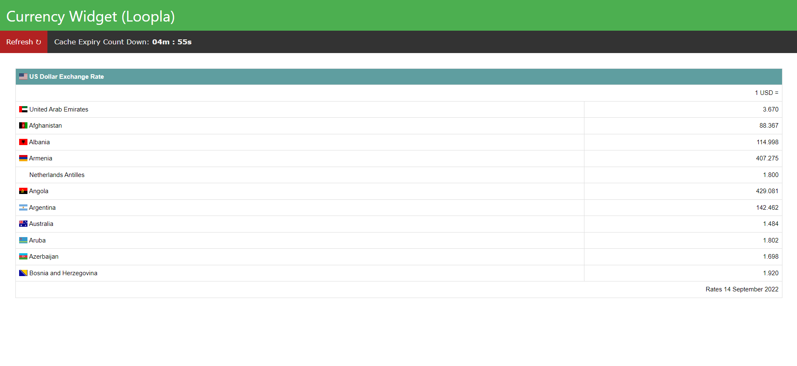
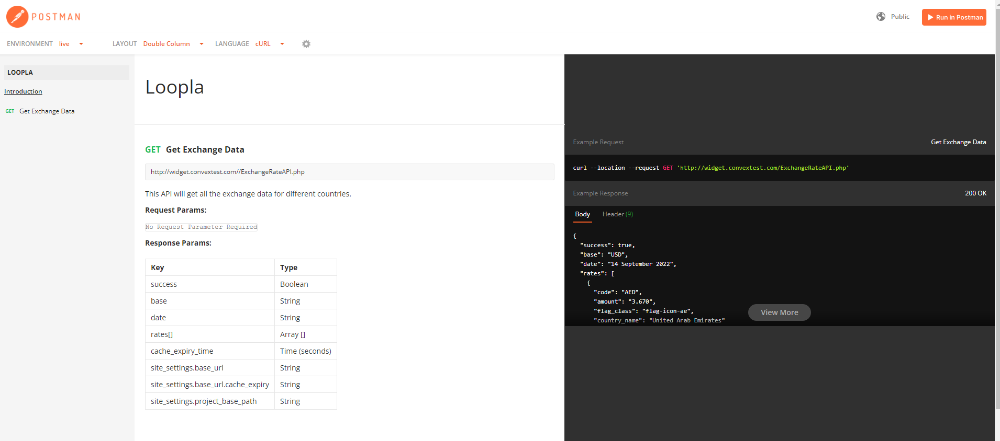

# Welcome to Currency Widget 👋

This project is all about currency exchange rates. It will return data using an API call right now using the free version of the API. Also cache the api calls for 5 Minutes to avoid rate limiting.

------
# [Demo](http://widget.convextest.com/)

**Responsive Layout :**

**Features:**

    - Create a simple frontend layout to display information nicely. 
    - Write ajax call for grabbing data from the frontend.
    - Write ajax call for grabbing data from the front end.
    - As the countdown ends the new API call will initiate for the latest data.
    - Created an API endpoint on the backend by using the OOP.
    - Write the documentation for the API endpoint in POSTMAN

**Postman URL**

[API Documentation](https://documenter.getpostman.com/view/3105892/2s7YYvZh67)

